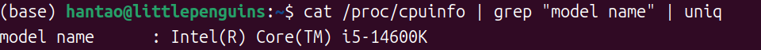
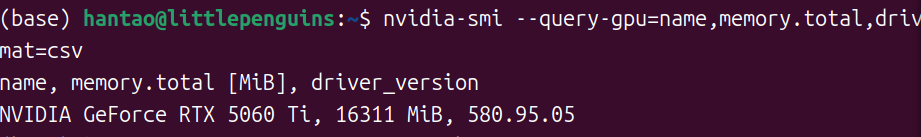
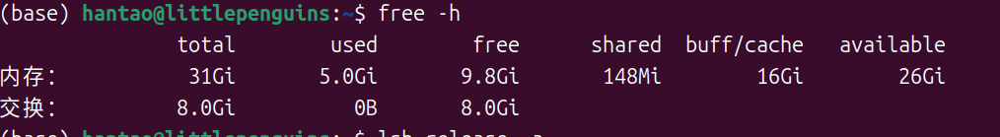
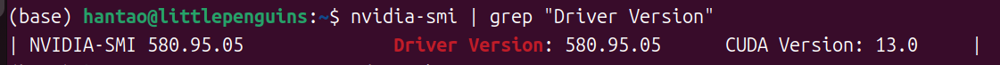
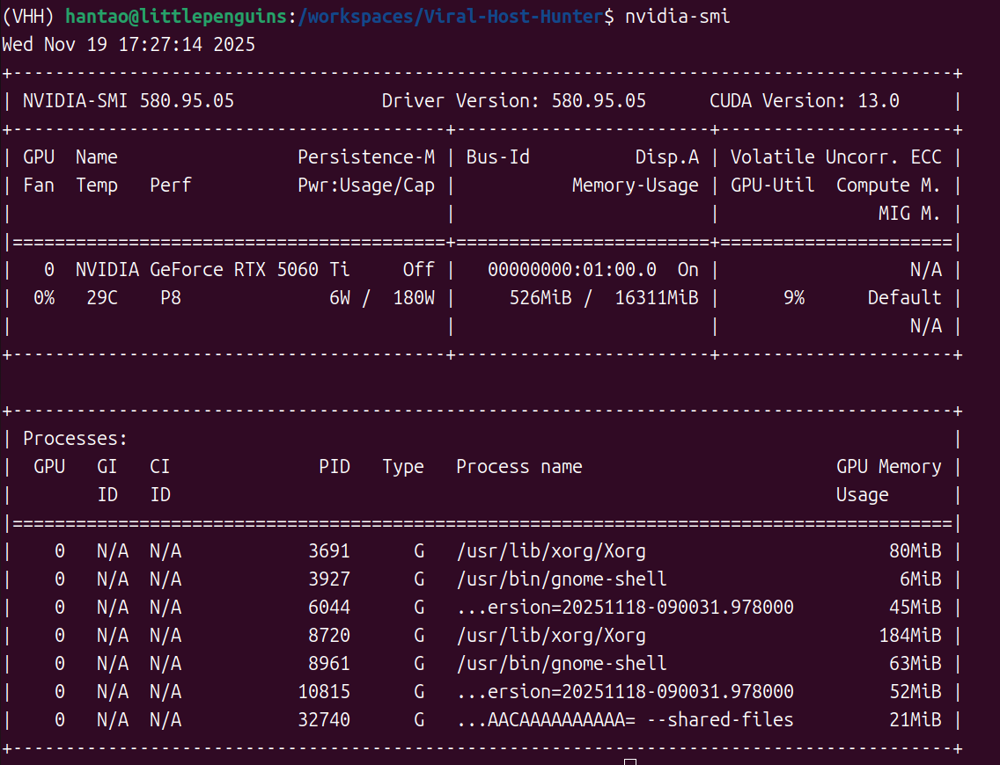
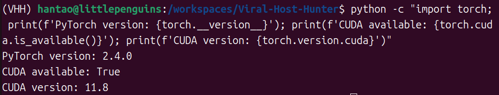

## Computational Environment Specifications

### 1. Hardware Configuration

- **CPU**

  ```bash
  cat /proc/cpuinfo | grep "model name" | uniq
  ```

  **Result**

  

- **GPU**

  ```bash
  nvidia-smi --query-gpu=name,memory.total,driver_version --format=csv
  ```

  **Result**

  

- **RAM**

  ```bash
  free -h
  ```

​		**Result**



### 2. Operating System

- **OS**

  ```bash
  lsb_release -a
  ```

​		**Result**


### 3. NVIDIA Driver and CUDA

- **NVIDIA Driver Version**

  ```
  nvidia-smi | grep "Driver Version"
  ```

​		**Result**





## Installation and Execution Steps

### Step 1: Repository Cloning

```bash
git clone https://github.com/YuehuaOu/Viral-Host-Hunter
cd Viral-Host-Hunter
```

### Step 2: Conda Environment Setup

```bash
# Create and activate conda environment
conda create -n VHH python=3.9 -y
conda activate VHH
```

### Step 3: PyTorch Installation with CUDA 11.8 Support

```bash
# Install PyTorch compatible with CUDA 11.8
conda install pytorch==2.4.0 torchvision==0.19.0 torchaudio==2.4.0 pytorch-cuda=11.8 -c pytorch -c nvidia -y
```

### Step 4: Environment Verification

```bash
# Verify CUDA availability and PyTorch installation
python -c "import torch; print(f'PyTorch version: {torch.__version__}'); print(f'CUDA available: {torch.cuda.is_available()}'); print(f'CUDA version: {torch.version.cuda}')"
```

**Result**



### Step 5: Viral-Host-Hunter Installation

```bash
# Install viral-host-hunter package
conda install -c bioconda viral-host-hunter -y
```

### Step 6: Package Dependencies Documentation

```bash
# Export environment packages
conda list > environment_conda.txt
pip list > environment_pip.txt
```

### Step 7: Model Prediction Execution

```bash
# Run viral-host prediction
vhh-predict \
    --protein ./examples/gut/tail/protein.fasta \
    --dna ./examples/gut/tail/dna.fasta \
    --phage_type gut \
    --seq_type tail \
    --embedding_dir ./examples/embedding \
    --output_dir ./examples/output \
    --model_dir ./models
```

**Note**: Replace `<path_to_models>` with the actual path to the pre-trained model directory.

